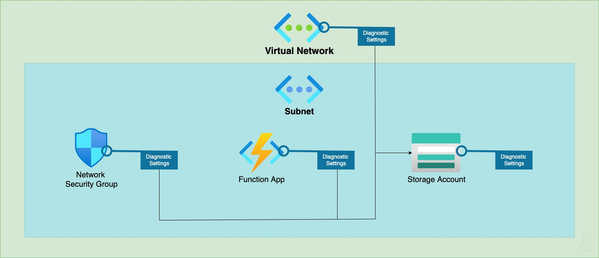

# Introduction 
This is a quickstart guide and sample [bicep file](./deploy/bicep/hipaa-compliant-sample.bicep) for creating HIPAA compliant projects. Resources deployed include:

- Virtual Network 
  - with service endpoint for storage
  - Diagnostic Settings saved in Storage Account
- Subnet
- Network Security Group
  - Diagnostic Settings saved in Storage Account
- Storage Account
  - Diagnostic Settings saved in Storage Account
- Function App



To test if your resource group is compliant after deploying, use the Azure Policy tool. Policy has many built-in policy initiatives. An initiative is just a set of rules for compliancy that are called policies. HITRUST/HIPAA is one of these built-ins, but you can also create custom initiatives and policies, if you have a unique case. (see steps in [Test section](#test))


# Prerequisites

To run the HITRUST/HIPAA policy evaluation, you must have an Azure subscription. If you want to scope the evaluation to a resource group, the resource group must already exist.

# Getting Started
TODO: Guide users through getting your code up and running on their own system. In this section you can talk about:
1.	Installation process
2.	Software dependencies
3.	Latest releases
4.	API references

# Build 
To build the bicep file using Azure CLI:
```shell
az bicep build --file "./deploy/bicep/hipaa-compliant-sample.bicep"
               [--no-restore]
               [--outdir]
               [--outfile]
               [--stdout]
``` 

# Test
To run the Policy evaluation for HIPAA compliance, follow these steps:

## Assign an Initiative
In Azure Portal, go to the Policy tool --> Definitions and search for HITRUST/HIPAA. Select the initiative, the Assign button, and follow the steps on the Assign page.

Azure CLI:
```shell
az policy assignment create [--assign-identity]
                            [--description]
                            [--display-name]
                            [--enforcement-mode {Default, DoNotEnforce}]
                            [--identity-scope]
                            [--location]
                            [--mi-system-assigned]
                            [--mi-user-assigned]
                            [--name]
                            [--not-scopes]
                            [--params]
                            [--policy]
                            [--policy-set-definition]
                            [--resource-group]
                            [--role]
                            [--scope]
                            [--sku {free, standard}]
```

## Run the Evaluation

Once assigned to a resource group or subscription, Policy will run the evaluation automatically for the first time and once every 24 hours after that. The evaluation process takes 20-60 minutes on average, but may take longer. You can also use the az cli command `az policy state trigger-scan [--resource-group]` to trigger the evaluation manually. 


# Additional Resources
[Azure CLI Bicep Commands](https://docs.microsoft.com/en-us/cli/azure/bicep?view=azure-cli-latest)
[Azure CLI Policy Commands](https://docs.microsoft.com/en-us/cli/azure/policy?view=azure-cli-latest)
[Details of the HIPAA HITRUST 9.2 Regulatory Compliance built-in initiative](https://docs.microsoft.com/en-us/azure/governance/policy/samples/hipaa-hitrust-9-2)
